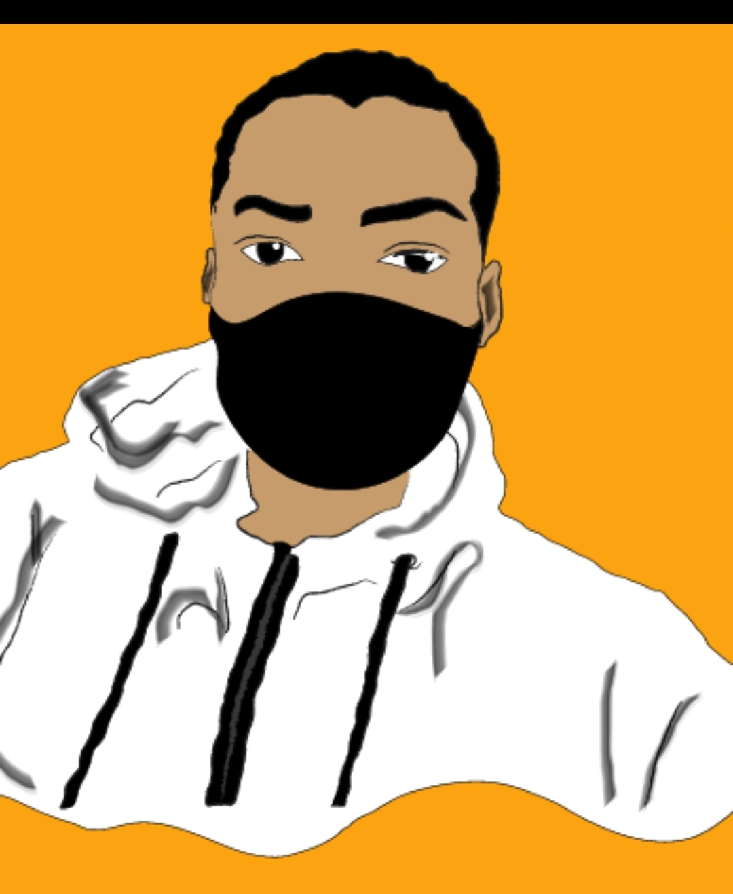

# Yo! Hello there!👋I'm Perfect Nkosi
#### (And I drew myself... in adobe illustrator 😎 cool huh?)


## WELCOME!
I'm a passionate full stack web developer with a knack for turning ideas into interactive and visually stunning digital experiences. My journey in the ever-evolving world of web development has equipped me with a diverse skill set, and I thrive on bringing creativity and functionality together. Building fast, engaging applications is top priority without compromising the easthetics! I like shiny things😁

This is my portfolio and you are free to change the source code however you like... use it as your own, go nuts! 🤪.

## Tech Stack
I used a bunch of techy things as listed below:
- ReactJs
- NextJs
- Typescript
- PostgreSQL
- Prisma
- MDX
- TailwindCSS
- Framer Motion (for the dope animations😁)

It's deployed on Vercel

## How to set it up
After cloning/downloading the repo, run 👉 
```shell
# To install the dependencies
npm install
```

```shell
# To view the website
npm run dev
```
### Static Assets (images, SVGs)
- Check inside the [public folder](./public/)
- I also included the Adobe Illustrator file that contains all the illustrations.

### About the Animations
If the animations are a bit too much for your taste, you can replace them with the [SVGs](./public/). Those SVGs are not animated✌️

### Follow me here on the Githubs...I'll follow you back

# **THANKS FOR CHECKING THIS OUT✌️**