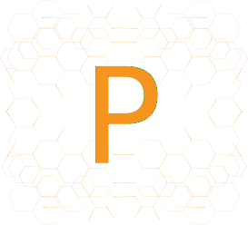

# Perfect Nkosi - Portfolio
## ***Feel free to use, and change the code. Go nuts! 😎***

simply 
``` 
    run 'yarn' to install dependencies
    run 'yarn dev' to view the website
```

## Tools used:
- React Js
- Tailwindcss
- Sanity for content management
- Vite as the bundler
- Yarn for managing packages


The illustration in the about section is from
<a href="https://www.vecteezy.com/free-vector/programmer">Programmer Vectors by Vecteezy</a>. Be a good sport and give attribution where it's due👍


---

### Last Modified:
- 10 Feb 2023


